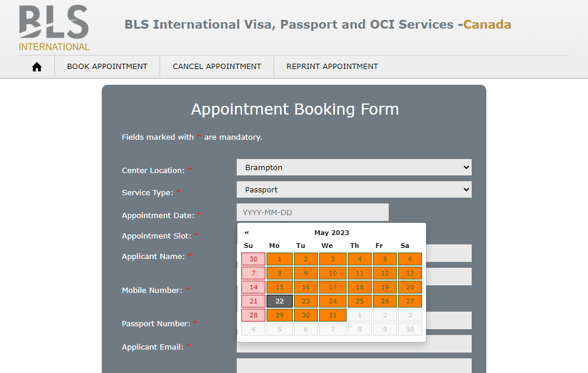

# **How I coded my way to the next available appointment.**
_**Disclaimer** : This is simply an alert mechanism that uses publicly available unencrypted data. Appointments are still to be booked manually._
## **Context**
For an Indian citizen living in the Greater Toronto Area (GTA), many of the services involving our passports, such as the passport renewal service, are provided at the BLS centres in Brampton or Toronto. However, getting an appointment at those centres is _next to impossible_. 
<br/><br/>


***Image 1**: No available appointments for the month.*
<br/><br/>

All the available slots are booked for the next two months and no new slots are issued for months following them. One of the ways to get the service is via walk-in appointments. To get those, one has to reach the centre early in the morning at 5 am, stand in the queue and wait. The centres open up at 8 am and their turn may come up by 11 am or later.

Another way to get an appointment is to hop-on on a cancelled one. Usually, people cancel their booking in the nick of time and one gets very few minutes to book it for themselves before someone else does. This means, refreshing the webpage regularly throughout the day and hoping to see any available slot pop up.

I realised that a better way to avoid the above hassles and grab the next available appointment was to write a script that regularly checked the webpage on my behalf and notified me whenever any slot was available.

**Tip:** Open the full code side-by-side while going through its explanation below.

## **Code's explanation**

All the appointments can be found on the BLS webpage: [Link](https://www.blsindia-canada.com/appointmentbls/appointment.php). The relevant locations for me were the **Brampton** or **Toronto** centres. The service type, in my case, was **Passport** (Refer to Image 1). So, the Python script to open the webpage and select the location & service type was as follows:

``` Python
'''
1. Open the webpage.
2. In the Location's dropdown, select Brampton or Toronto.
3. In the Service Type's dropdown, select Passport.
'''

import time
from selenium import webdriver
from selenium.webdriver.common.by import By
from selenium.webdriver.support.ui import Select

APPOINTMENT_WEBPAGE_URL = "https://www.blsindia-canada.com/appointmentbls/appointment.php"

if __name__ == '__main__':
 
  # Open the webpage
  browser = webdriver.Chrome()
  browser.get(APPOINTMENT_WEBPAGE_URL)

  # Assign elements to variables
  locationDropdown = Select(browser.find_element(By.ID, 'location'))
  serviceTypeDropdown = Select(browser.find_element(By.ID, 'service_type'))
  
  CITY_LIST = ["Brampton", "Toronto"]
  for city in CITY_LIST:
    locationDropdown.select_by_visible_text(city)             #Select Brampton followed by Toronto
    serviceTypeDropdown.select_by_visible_text("Passport")    #Select 'Passport' as service type
    time.sleep(5)
    
    #script to be continued below.
```
<br/><br/>
Once the location and service type dropdowns are selected, we click on the **Date** option. A calendar pops up highlighting the unavailable and available dates. Here, I wrote a function, _**check_Appointments()**_, that traversed through all the dates of the current month followed by the next month. Incase any slot on any date was available, the function would return True and I would get notified about it by the function _**notify_Me()**_. The Python script for traversing the calendar is as follows:

```Python
'''
4. Click on the Date field for the calendar to pop up.
5. Traverse through the calendar using a function check_Appointments()
6. If an appointment is available, notify me using the function notify_Me()
'''

#Continued from above
if __name__ == '__main__':
 
  # Open the webpage
  browser = webdriver.Chrome()
  browser.get(APPOINTMENT_WEBPAGE_URL)

  # Assign elements to variables
  locationDropdown = Select(browser.find_element(By.ID, 'location'))
  serviceTypeDropdown = Select(browser.find_element(By.ID, 'service_type'))
  appDateTextField = browser.find_element(By.ID, 'app_date')

  CITY_LIST = ["Brampton", "Toronto"]
  for city in CITY_LIST:
    locationDropdown.select_by_visible_text(city)              #Select Brampton followed by Toronto
    serviceTypeDropdown.select_by_visible_text("Passport")     #Select 'Passport' as service type
    time.sleep(5)
    appDateTextField.click()                                   #Click to pop calendar up

    currentMonthStatus = check_Appointments()                  #Check appointments for this month

    #Toggle to next month
    nextButtonXpath = "//html/body/div[5]/div[1]/table/thead/tr[1]/th[3]"
    nextButton = browser.find_element(By.XPATH, nextButtonXpath)
    nextButton.click()

    nextMonthStatus = check_Appointments()                     #Check appointments for next month

    if(currentMonthStatus or nextMonthStatus):                  
      notify_Me()                                                                      
    
  browser.quit()
```
<br/><br/>
The _**check_Appointments()**_ function's script is below. Here, I traversed the dates using their [XPaths](https://medium.com/r/?url=https%3A%2F%2Fwww.lambdatest.com%2Fblog%2Fcomplete-guide-for-using-xpath-in-selenium-with-examples%2F) and checked their availability using their Class names - both of which can be found using the _inspect element_ option in Google Chrome.

```Python
# Class names of available slots (to be found using 'Inspect Element' in Google Chrome)
AVAILABLE_APPOINTMENT_CLASSNAME_1 = "day activeClass"
AVAILABLE_APPOINTMENT_CLASSNAME_2 = "new day activeClass"
AVAILABLE_APPOINTMENT_CLASSNAME_3 = "active day activeClass"

# Function to check availability of appointments:
def check_Appointments() -> bool:
  for week in range(1,7):    #Six rows for six weeks (Week[-1] + Week[1-4] + Week[+1]) is displayed
    for day in range(1,8):   #Seven days per week
      
      dateXPath = "//html/body/div[5]/div[1]/table/tbody/tr[" + str(week) + "]" + "/td[" + str(day) +"]"       # XPaths of dates (to be found using 'Inspect Element' in Google Chrome)
      dateClass = browser.find_element(By.XPATH, dateXPath)

      if (dateClass.get_attribute("class") == AVAILABLE_APPOINTMENT_CLASSNAME_1
            or dateClass.get_attribute("class") == AVAILABLE_APPOINTMENT_CLASSNAME_2
            or dateClass.get_attribute("class") == AVAILABLE_APPOINTMENT_CLASSNAME_3):
          return True
  return False
```
<br/><br/>
Finally, I wrote the _**notify_Me()**_ function, which emailed me whenever a slot was available. The email would ping my phone up and I would instantly know about it. The Python function for it is below.

```Python
import smtplib
from email.mime.text import MIMEText
from email.mime.multipart import MIMEMultipart

APP_PASSWORD = "Gmail's App Password"       #This is different from Gmail account's password
EMAIL_TO = "yourEmail-2@gmail.com"          #This can be the same email i.e your Email-1@gmail.com
EMAIL_SUBJECT = "Appointment available"
EMAIL_BODY = "There is a slot available, book now!"

def notifyMe():
  #Define email content
  email = MIMEMultipart()
  email['From'] = EMAIL_FROM
  email['To'] = EMAIL_TO
  email['Subject'] = EMAIL_SUBJECT
  body = EMAIL_BODY
  email.attach(MIMEText(body, 'plain'))

  #Send email
  server = smtplib.SMTP('smtp.gmail.com', 587)
  server.starttls()
  server.login(EMAIL_FROM, APP_PASSWORD)
  text = email.as_string()
  server.sendmail(EMAIL_FROM, EMAIL_TO, text)
  server.quit()
```
<br/><br/>
**Note:** Here, the APP_PASSWORD is not your Gmail account's password. One can set up their account's App-Password using the following [Link](https://help.warmupinbox.com/en/articles/4934806-configure-for-google-workplace-with-two-factor-authentication-2fa).
Now, to run this script periodically throughout the day, I set up a cronjob that triggered it after every five minutes. The cronjob is as follows:

```Bash
*/5 * * * * /usr/bin/python3 /home/ubuntu/blsScript.py
```
<br/><br/>
Since running the script every five minutes on my laptop was not a feasible solution, I decided to use the **AWS EC2** instance which is free of cost and will run all the time to carry out my job. To run the script in an ubuntu-Ec2 instance, I configured a **headless browser** inside the script. The configurations are written below.

**Note:** Here, the first line of the main function gets slightly modified.

```Python
from selenium.webdriver.chrome.options import Options

# Constants
WEBDRIVER_BINARY_PATH = "/usr/bin/chromedriver"
APPOINTMENT_WEBPAGE_URL = "https://www.blsindia-canada.com/appointmentbls/appointment.php"

# Configs for a headless browser
chrome_options = Options()
chrome_options.add_argument('--headless')
chrome_options.add_argument('--disable-gpu')
chrome_options.add_argument('--no-sandbox')
chrome_options.add_argument('--disable-dev-shm-usage')

# Main Function
if __name__ == '__main__':
 
  # Open URL
  browser = webdriver.Chrome(WEBDRIVER_BINARY_PATH, options=chrome_options)
  browser.get(APPOINTMENT_WEBPAGE_URL)

  #Remaining script is the same.
```
<br/><br/>
Voila! Although it took me five working days to get the next appointment, I could avoid waking up early and standing in the queue in the chilly Canadian winters.

## **Inspiration Credits:**

1. A similar blog by my friend Noel Varghese: https://medium.com/hackernoon/how-i-coded-my-way-to-early-tickets-for-avengers-endgame-f2efa3a128a8

## **Probable errors, issues and their troubleshooting:**

1. Installing Google Chrome in Ubuntu-Ec2: https://stackoverflow.com/questions/62848916/running-google-chrome-headless-on-ec2-ubuntu-server

2. App-Password error - smtplib.SMTPAuthenticationError: (534, b'5.7.9 Application-specific password require: https://help.warmupinbox.com/en/articles/5445830-google-error-invalid-login-534-5-7-9-application-specific-password-required